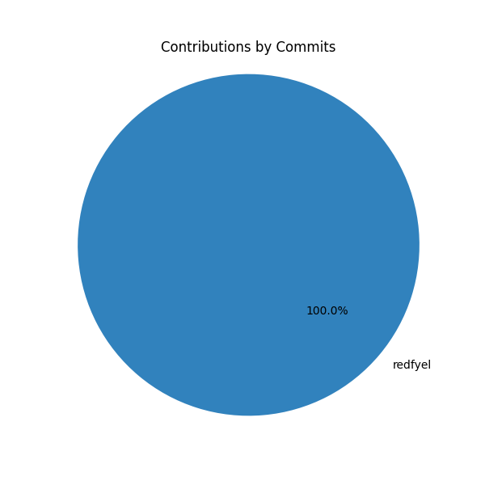

# 🧁 Contributor Pie Chart Generator

This GitHub Action **automatically generates a pie chart** that visually represents each contributor’s impact on your repository — based on **commit counts**. It's a fun and professional way to highlight individual efforts and track contributions at a glance.

## Contribution Pie Chart of this Repo!


---

## ✨ Features

- 🎯 **Commit-Based Contribution Analysis**  
  Track contributions by commit counts and display them visually.

- 🎨 **Custom Color Palette Support**  
  Personalize the chart's appearance with your own color palette (optional).

- 📏 **Customizable Chart Size**  
  Modify the chart's size to fit your needs (optional).

- 🤖 **Bot Contributions Filtered Separately**  
  Separate out bot contributions (e.g., GitHub Actions) in the chart.

- 🖼️ **Auto-Generated Chart Image in Repository**  
  The pie chart is automatically created and saved in your repository.

- 📝 **README Auto-Updated with Chart**  
  The chart is added to your `README.md`, and it gets updated automatically with each new commit.
---

## ⚙️ Usage - Step-by-Step Guide

### 1. Setup Workflow Permissions
- Open your repository.
- Click on the **Settings** tab.
- Navigate to **Actions** → **General**.
- Scroll down to the **Workflow permissions** section and select **Read and write permissions**.

### 2. Add the Workflow File
- Add the following YAML configuration to your `.github/workflows/contributor-chart.yml`. ("Add File" → under file name, give ".github/workflows/contributor-chart.yml" → Paste below code)
- Be sure to replace `your-username` and `your-repo` in the `repo-url` with your own GitHub username and repository name.
- You can also customize the chart size and color palette if desired.

```yaml
name: Generate Contributor Pie Chart

on:
  push:
    branches:
      - main  # Trigger on push to the main branch

jobs:
  generate:
    uses: your-username/contrib-pie-generator/.github/workflows/main.yml@v1
    with:
      chart-size: '8,8'  # [Optional] Input for chart size (width,height)
      palette: '#0A122A,#698F3F,#E7DECD'  # [Optional] Custom color palette (comma-separated hex values)
      repo-url: 'https://api.github.com/repos/your-username/your-repo/contributors'  # Replace with your repository info
```

### 3. Action!
Upon every new update/commit, the chart gets updated automatticaly and it is reflected in your `README.md`

## 🙌 Contribute
Feel free to open issues or pull requests if you have any improvements, bug fixes, or feature requests.

### Here's to pretty charts, more accountability and more credit where due 🖤
